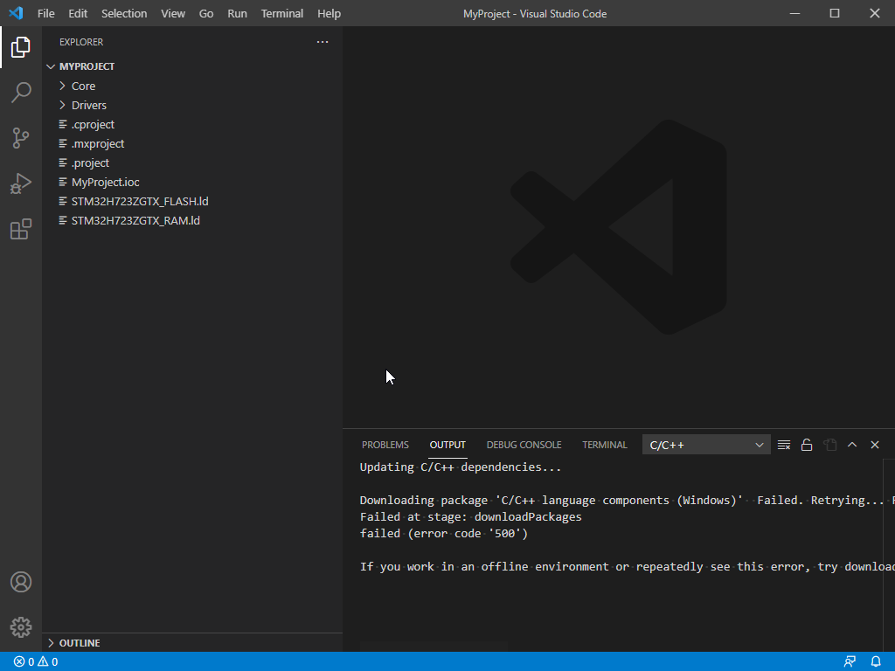
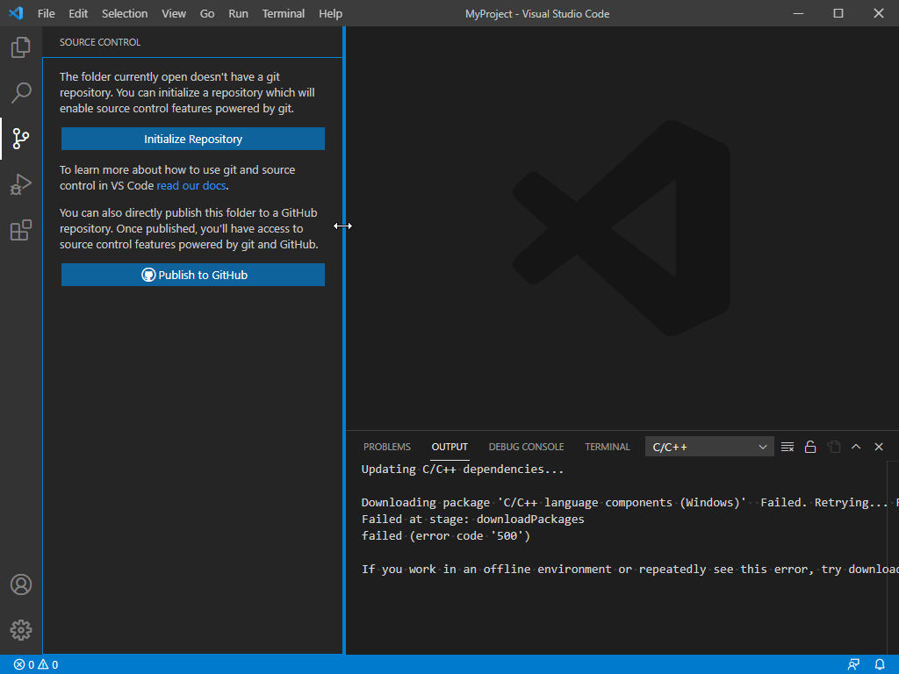
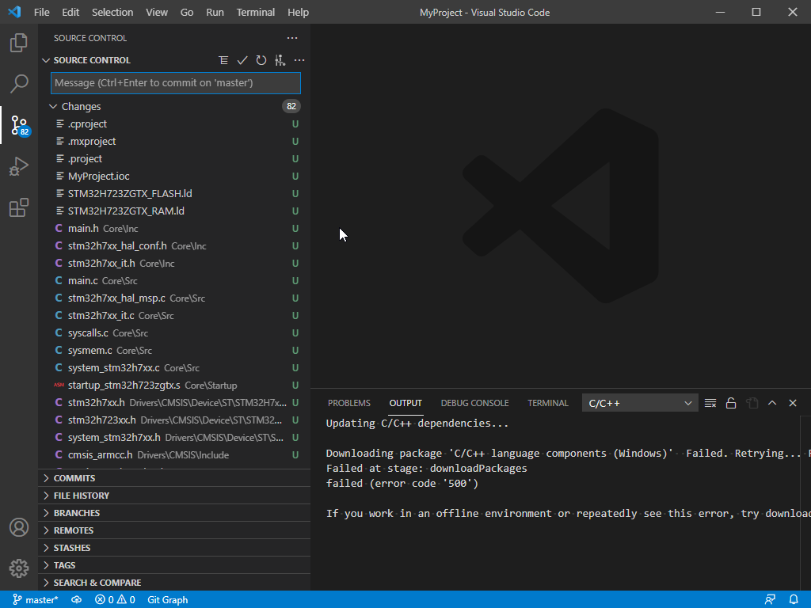
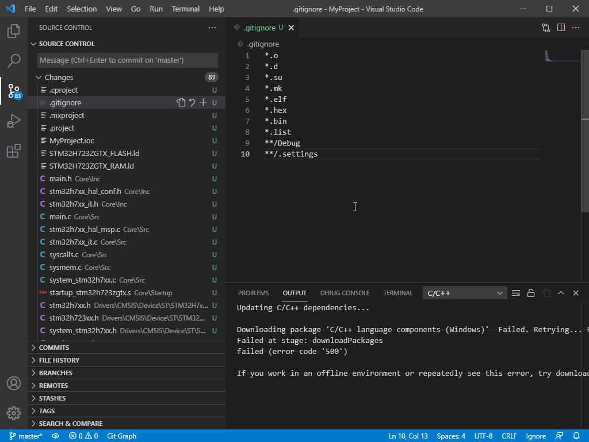
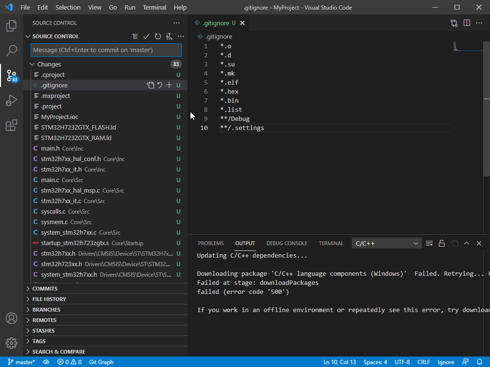
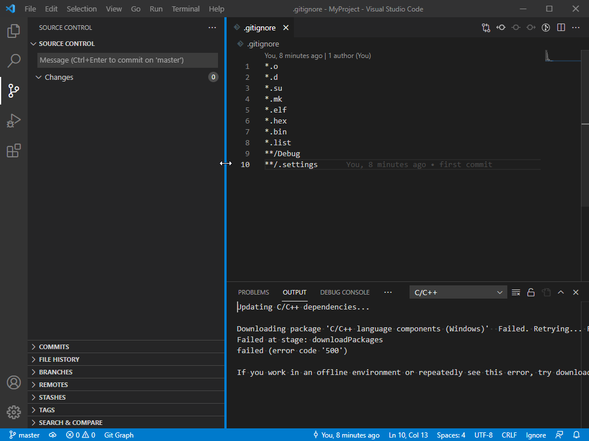

# Standalone git repositroy

## Use git on basic project

For one project only. As CubeMX example. 

1. Generate CubeMX project.

2. Open project in VS 
   1. Use `File>Open Folder`
   2. In Total Commander go to folder and type `code .`

3. Go to git tab



4. Initialize git repository



Now the git is active in our folder, but we dont was himt to remember all files so we will use `.gitignore` file 

5. Create `.gitignore` file



6. Ignore support project files

```
*.o
*.d
*.su
*.mk
*.elf
*.hex
*.bin
*.list
**/Debug
**/.settings
```

Git ignore details [link](https://git-scm.com/docs/gitignore)

7. Create first commit

Commit save state of all stagged files.
If not stagged file selected VS commit all changed files

   1. Stage one file



Commit all files



## Check the commits

We can use git graph to see what is our repository state



## Create remote repository on github

1. Open github
   
[Link](github.com)

2. Logint to yout account

