# Standalone git repositroy

## Use git on basic project

For one project only. As CubeMX example. 

1. Generate CubeMX project.

2. Open project in VS 
   1. Use `File>Open Folder`
   2. In Total Commander go to folder and type `code .`

3. Go to git tab

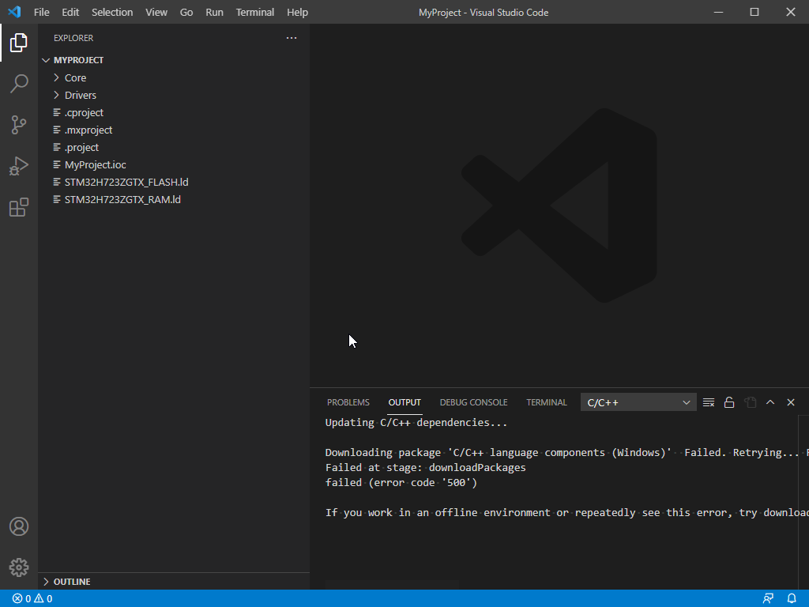

4. Initialize git repository

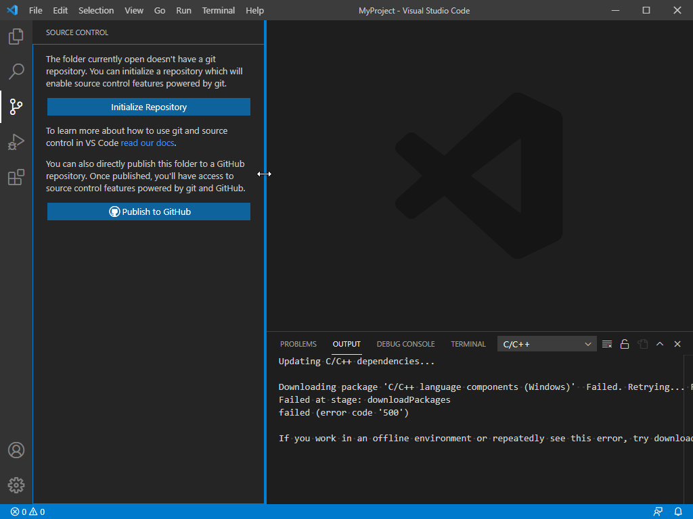

Now the git is active in our folder, but we dont was himt to remember all files so we will use `.gitignore` file 

5. Create `.gitignore` file

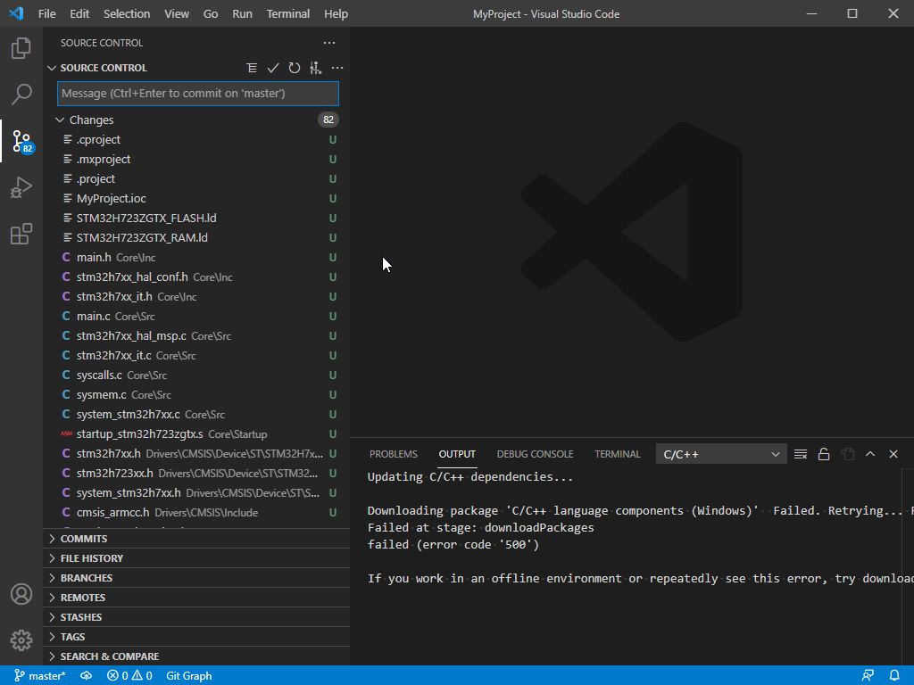

6. Ignore support project files

```
*.o
*.d
*.su
*.mk
*.elf
*.hex
*.bin
*.list
**/Debug
**/.settings
```

Git ignore details [link](https://git-scm.com/docs/gitignore)

7. Create first commit

Commit save state of all stagged files.
If not stagged file selected VS commit all changed files

   1. Stage one file


Commit all files

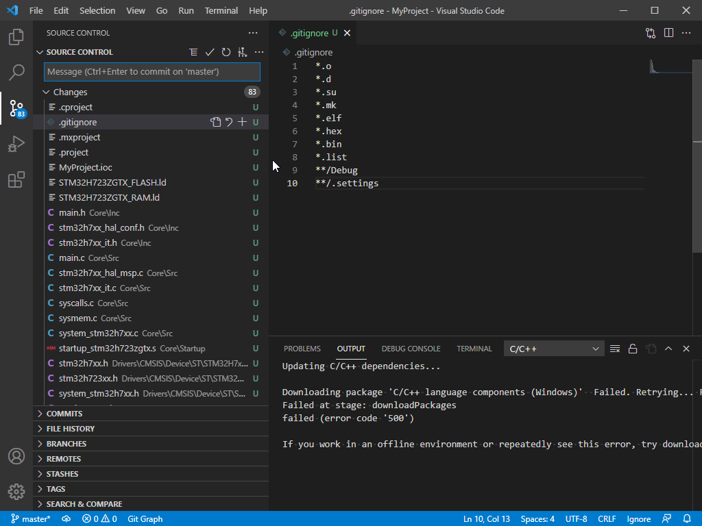

## Check the commits

We can use git graph to see what is our repository state

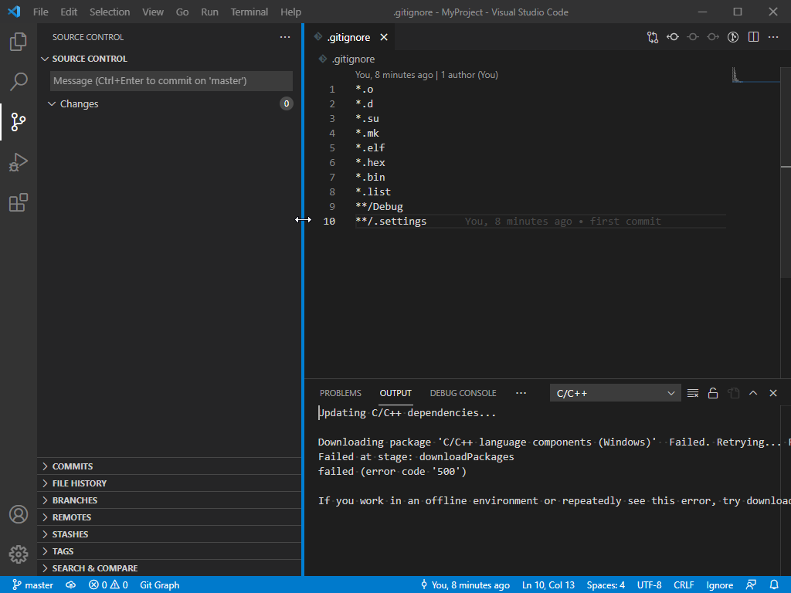

## Create remote repository on github

1. Open github
   
[Link](github.com)

2. Logint to yout account

3. Got to repositroy Tab and creane new repository

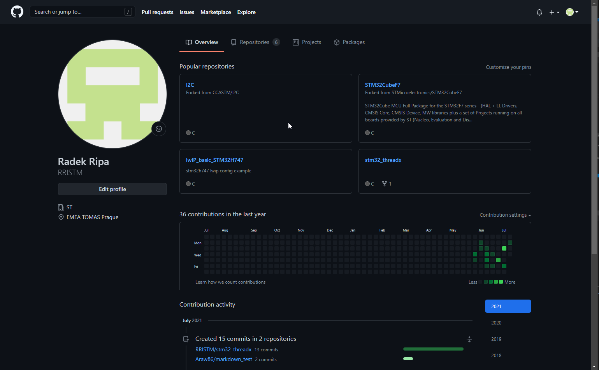

4. Name you repository

In my case `MyRepository`

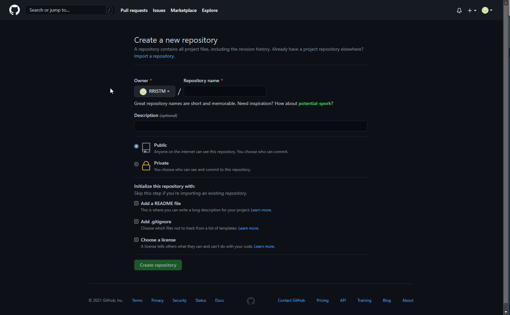

8. Copy repository link

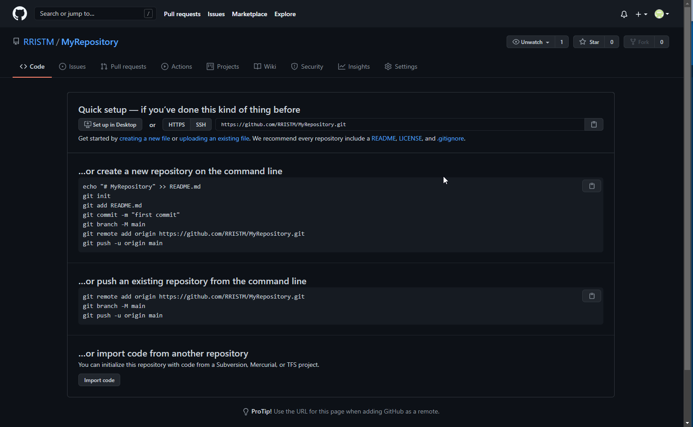

9. Return back to VS

10. Select `add remote`

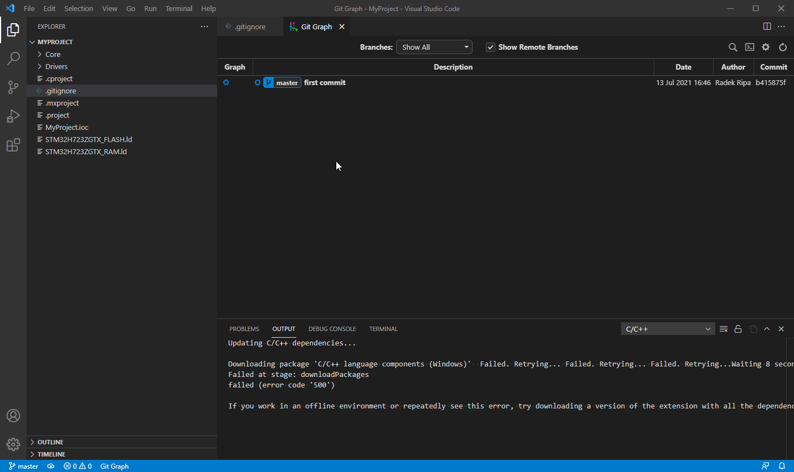

11. Paste the github address to repository
12. Name you repository

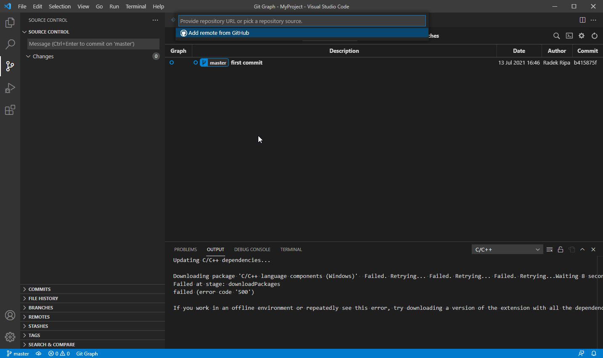

13. Push your repository

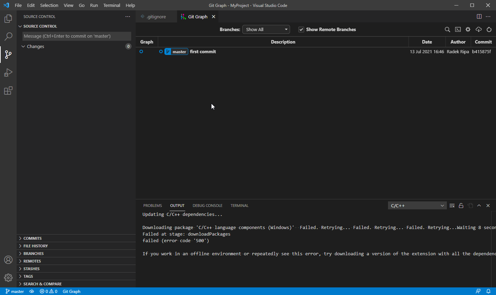

14. Fill user name and password to github
15. Check push is done in git graph

Now our project is also present on github

## Adding readme

The github can display readme.md file when resent. 

1. Create readme.md file

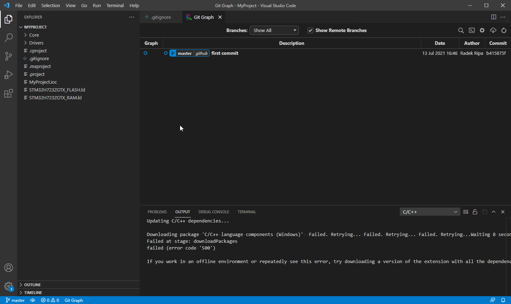

2. Put your description
3. Commit files
4. Push files to github

Readme is then visible directly on repository main page

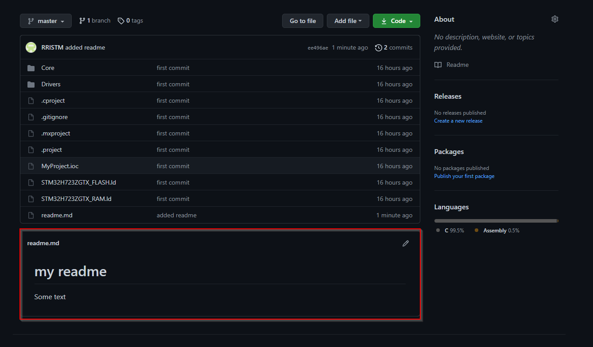
