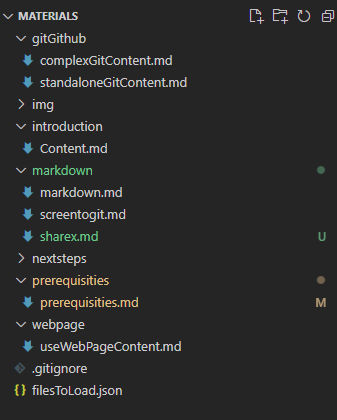

# Use web page to show md content

For this i created simple page which will be loaded first. Same as bootloader on STM32. This webpage will load the filesToLoad.json from your page and display its content. 

## Prepare content

For this we need to have few things. 

Prepare your md files to correct git folder. 
Like in this case. 



All md files are present also images. All content to show is in `master` branch.

## filesToLoad.json file

To be able show all content as website we need to create `filesToLoad.json` file which will work as site descriptor. 

What must be there

```json
{
  "title": "STM32 material preparation",
  "githubLoc": "https://raw.githubusercontent.com/RRISTM/stm32_material_preparation/master",
  "options": {
    "allowMenu": true,
    "allowTagSelect": false
  },
  "filesToLoadArr": [
  ],
  "menuStructure": [
  ]
}
```

`title` is title of your page how it will be named in browser

`https://raw.githubusercontent.com/RRISTM/stm32_material_preparation/master` is path to github where is this file. In my case `RRISTM` account, `stm32_material_preparation` repository, rest is fixed. 

`options` allow to set  page behaviour. 
    `allowMenu` allow to show menu for all your pages
    `allowTagSelect` add menu git TAG menu which can switch the page content based on your TAG

### filesToLoadArr

List of all files which will be possible to display. 
For example this page will be added there as:

```json
  "filesToLoadArr": [
    {
      "name": "create web page",
      "path": "/webPage",
      "file": "useWebPageContent.md"
    }
  ],
```

`name` unique name, used only in this file
`path` path to location where this file is located
`file` real file name

If more elements are added there must be separted by `comas`
Like here:

```json
  "filesToLoadArr": [
    {
      "name": "create web page",
      "path": "/webpage",
      "file": "useWebPageContent.md"
    },
    {
      "name": "prerequisities",
      "path": "/prerequisities",
      "file": "prerequisities.md"
    }
  ]
```

### menuStructure

This is content of our menu.
Simple menu is

```json
 {
      "name": "create web page",
      "type": "File",
      "file": "useWebPageContent.md"
    },
    {
      "name": "prerequisities",
      "type": "File",
      "file": "prerequisities.md"
    }
```

`name` and `file` must be same as in `filesToLoadArr`.

This will create content like:


You can also create folders in menu:

```json
    {
      "name": "GPDMA basic work",
      "type": "Folder",
      "children": [
        {
          "name": "Memory to memory",
          "type": "File",
          "file": "simple_m2m.md"
        }
      ]
    }
```

Here we have ` type Folder` this will allow add children to it which will be element inside folder. 

Example here:
[page](https://rristm.github.io/tomas_materials_v2/RRISTM/stm32_gpdma/master)
[filesToLoad.json](https://github.com/RRISTM/stm32_gpdma/blob/master/filesToLoad.json)

## Address link

When the filesToLoad is done. We can upload content to github. And then simply use this link:
**https://rristm.github.io/tomas_materials_v2/GITHUBACCOUNT/GITHUBREPOSITORY**

In my case GITHUBACCOUNT is `RRISTM`
And GITHUBREPOSITORY is `stm32_material_preparation`

[https://rristm.github.io/tomas_materials_v2/RRISTM/stm32_material_preparation]([stm32_material_preparation](https://rristm.github.io/tomas_materials_v2/RRISTM/stm32_material_preparation))